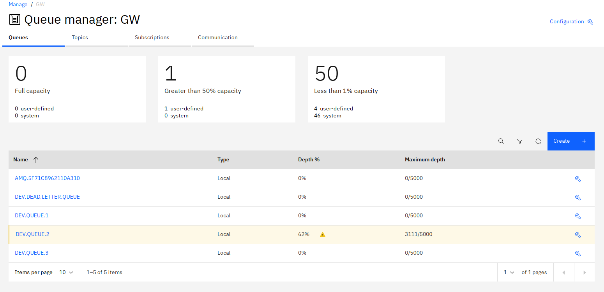

# Gatling MQ Reproducer

To reproduce the issue, run 

```
docker-compose up
<wait until build is finished and MQ is responding on HTTPS port 9443>
./mvnw -pl tests/gatling gatling:test
```

Eventually the simulation will start recording KOs (starting around the 300 s mark) as shown in the following example output:

```
================================================================================
2020-09-28 13:36:20                                         360s elapsed
---- Requests ------------------------------------------------------------------
> Global                                                   (OK=13712  KO=5506  )
> DEV.QUEUE.1                                              (OK=13712  KO=5506  )
---- Errors --------------------------------------------------------------------
> Reply timeout after 10000 ms                                     5506 (100.0%)

---- MQ Simulation -------------------------------------------------------------
[##############-----------------------------------------                   ] 20%
          waiting: 23997  / active: 52785  / done: 19218 
================================================================================
```

IBM MQ queue state can be inspected at: https://localhost:9443/ibmmq/console/#/manage/qmgr/GW/queues (user: admin / password: passw0rd - you may need to click on the link again after logging in to be taken to the right page):



Request queue: DEV.QUEUE.1 \
Response queue: DEV.QUEUE.2 (will start accumulating messages)